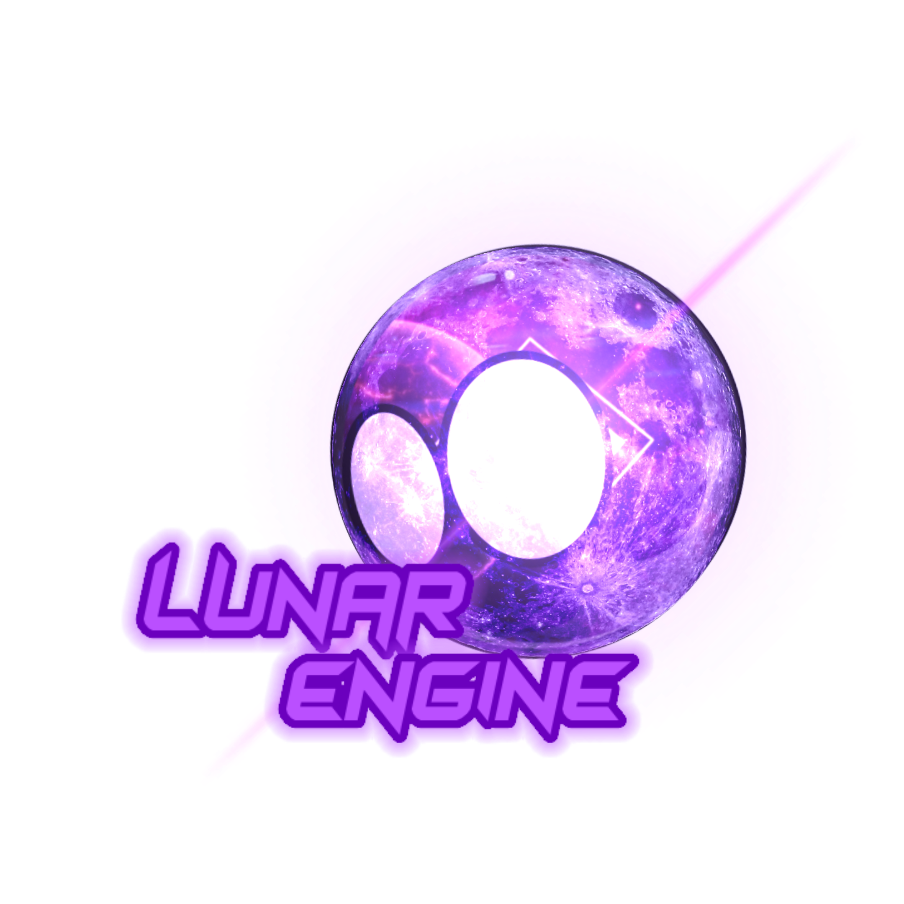
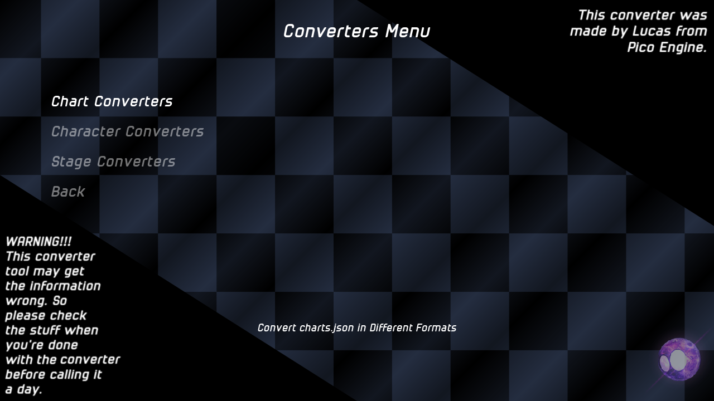
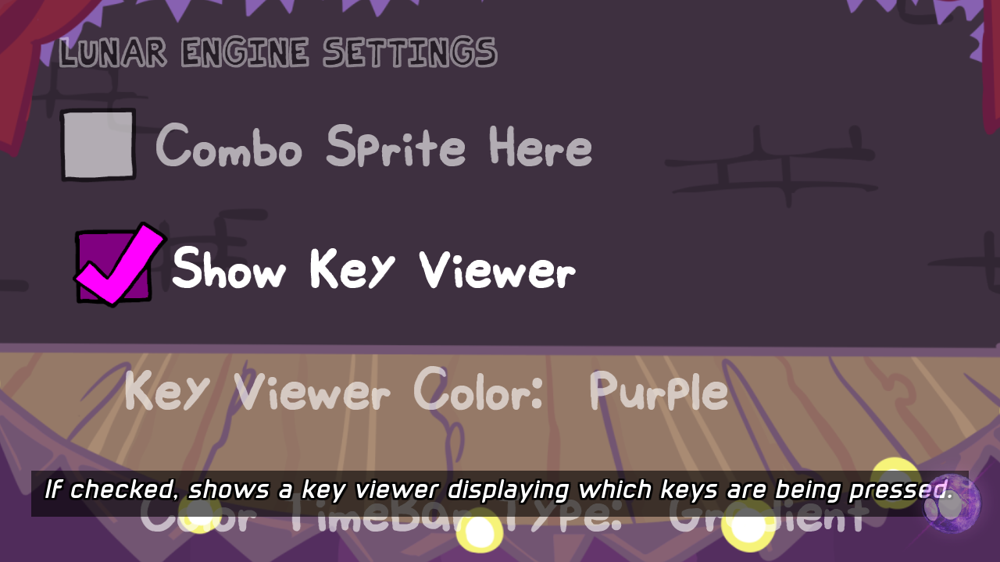
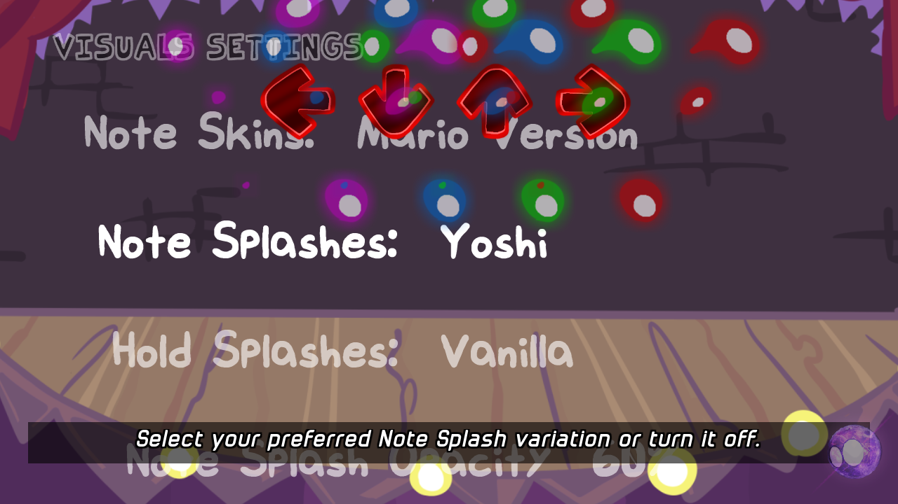
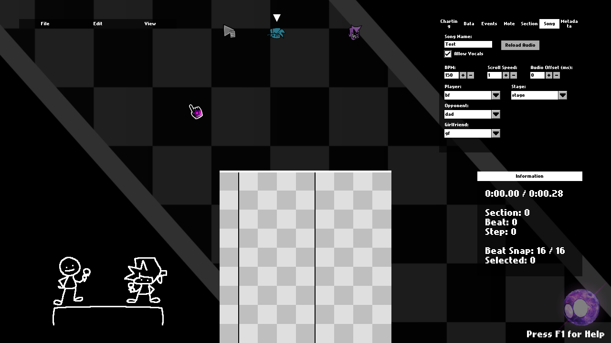
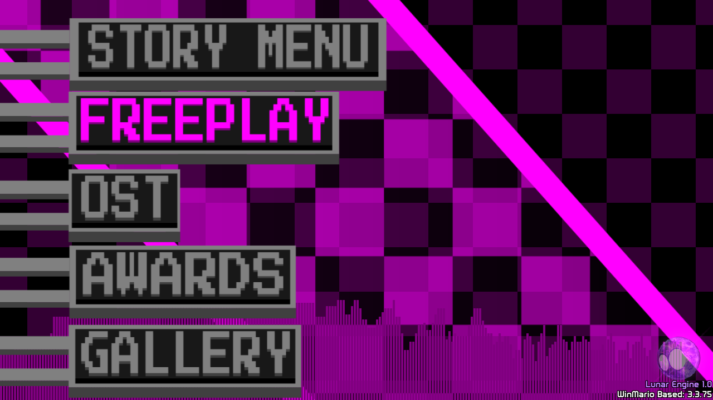
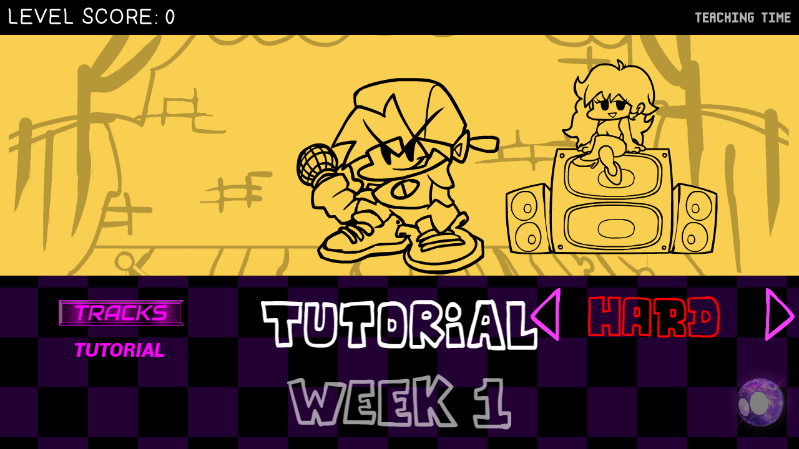
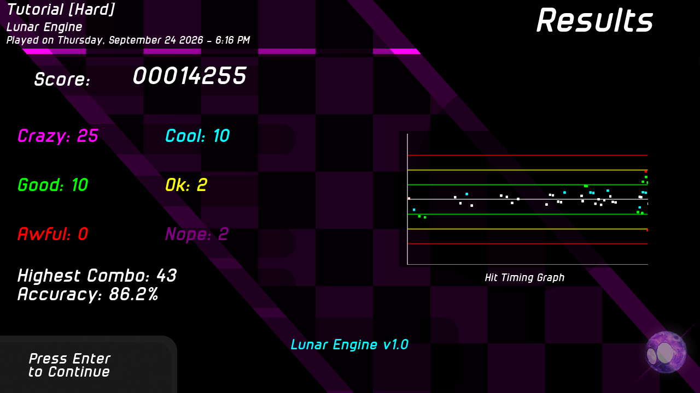

# Lunar Engine
(not to get confused with [Kirby's Lunar Engine](https://github.com/KirbyKid256/LunarEngine-Archive))

### -☆- What's that? -☆-
Lunar Engine is a Forked Engine of [P-Slice](https://github.com/Psych-Slice/P-Slice), where it shows or uses the Elements, Stuff, and Utils of [Vs. WinMario](https://github.com/JerryXP/Vs-WinMario). Yes. This is also known as "*WinEngine*" where it is a [Modified Psych Engine](https://github.com/ShadowMario/FNF-PsychEngine) before [P-Slice](https://github.com/Psych-Slice/P-Slice). It's also known as *WinMario Engine*. But, I decided to make it called **Lunar Engine** because i'd like it better. But still... yes it's [modified psych 1.0.4](https://github.com/ShadowMario/FNF-PsychEngine) because it's easier for me to use.
 

### -☆- Rules -☆-
It's Ok to use my engine, at least I credit almost everyone, but anyways there are rules. If you use my engine, please just credit me for using it, I said it's a engine trying to be my mod I created, [Vs. WinMario](https://github.com/JerryXP/Vs-WinMario). Dave & Bambi Mods are ok, but using it for Spam tracks or Spamming keys are prohibited, because I don't want my engine to be popular because of your Dave & Bambi Spamming Track Mod. Do not use my Engine to program Malware or any Malicious. And last, do not ask for Android or iOS builds. And I have prove why: [https://youtube.com/shorts/_oE-09RRod0?si=k7mI4Vo3jhgOZfSn](https://youtube.com/shorts/_oE-09RRod0?si=k7mI4Vo3jhgOZfSn) 
Cause that's annoying to FNF Devs.
 

### -☆- What's the Difference? -☆-
1. It has Winning Icons. Which is where if you had 80% or more... It will load! yeah yeah. It's optional. (it needs t9o be 450x150)(please thank [DaPootisBirdYT](https://gamebanana.com/members/2031145)  
  

2. It has Converters Menu. Where you can port any different Engine like [V-Slice](https://github.com/FunkinCrew/funkin) & [Codename](https://github.com/CodenameCrew/CodenameEngine) to Lunar (aka [P-Slice Fork](https://github.com/Psych-Slice/P-Slice)). But it can get the Information wrong. So please check everything before finishing it. (please thank [Lucas](https://github.com/Lucas62944) from [Pico Engine](https://github.com/Pico-Engine-Team))     

3. New Options added like changing the time bar color, Score Text Info, Keybinds Viewer, and more at Lunar Engine Options. (please thank [TintGox](https://github.com/TintGox) & [Lenin](https://github.com/LeninAsto) from [The Psych Plus Team](https://github.com/Psych-Plus-Team))
    

4. (Windows Only) When you close the game, the eindoe will do a fade out animation (please thank [Slushi](https://github.com/Slushi-Github) from [Slushi Engine](https://github.com/Slushi-Github/Slushi-Engine) & [Lenin](https://github.com/LeninAsto) from [The Psych Plus Team](https://github.com/Psych-Plus-Team))  (you need to go to docs/thevideofile.mp4 to see what it looks like.) 

5. Add more Notes & it's splashes , and Add Lil Buddies in the Chart Editor (please thank [Rozebud](https://github.com/ThatRozebudDude) for [Original](https://github.com/ThatRozebudDude/FPS-Plus-Public) and & [Awe](https://github.com/Awe-Some-Jack) from [AS Engine](https://github.com/Awe-Some-Jack/FNF-AS-Engine) for port.)       

6. Add a Grid & Funkin Visulizer at the Main Menu State, Add a Grid in the Story Menu, and Have a new results screen. (please thank [Lenin](https://github.com/LeninAsto) from [The Psych Plus Team](https://github.com/Psych-Plus-Team)) 
          

7. the "scripts" folder is split-up into "luaScript" (Lua only) & "haxScript" (HX Only) 

### -☆- Information -☆-
[P-Slice](https://github.com/Psych-Slice/P-Slice) Version: 3.4.2 
*The engine I am currently using*
 

[Psych](https://github.com/ShadowMario/FNF-PsychEngine) Version: 1.0.4 
*I was originally going to use 0.7.3 but SScript was not supported anymore, but since I use 1.0.4, it made me a lot better, and you know what? 1.0.4 made a huge improvements from 0.7.3, you know like... It finally has Haxe Script fix. :)*
 

FNF Emulator Version: 0.7.6 
*The [funkin](https://github.com/FunkinCrew/funkin) version we tried to emulate."
 

### -☆- Requirements -☆-
[Windows](https://www.microsoft.com/windows), [MacOS](https://www.apple.com/mac/), and/or [Linux](https://www.linux.org/pages/download/) PC is needed. 
(Linux Only) [Install VLC](https://www.videolan.org/vlc/) 
(MacOS w/ ARM or Apple Silicon Chips Only) [Install Rosetta](https://support.apple.com/102527) 
Storage: 256 GB 
RAM: 8 GB 
Your Computer needs to be 64-Bit 
(Windows Only) Windows 7 or 8 Is minimum to run my Engine 
(MacOS Only) MacOS 14 Sonoma Is minimum to run my Engine 

### -☆- If your on Mac & trying to compile the game, then please listen. -☆-
So you're trying to compile my Engine but it failed, then it's possibly because you extract my Code by using Double left click. Which is wherer it can exclude the files. So... to also include the folders that have been exclude, open terminal and type (unzip "") place the zipped or tar.gz folder inside the terminal, and it will extract it. 

### -☆- Setup -☆-
1. Install [Haxe](https://haxe.org) 4.3.6 or 4.3.7 
2. Install [HaxeFlixel](https://haxeflixel.com/documentation/install-haxeflixel/) 
3. Install [Git](https://git-scm.com/install/) 
4. Install all libaries through the setup folder by left clicking it. (if Mac or Linux, open Terminal and type "chmod +x unix.sh" (replace +x with 755 if you have issues) and type "./unix.sh" and it will install.) 
5. Compiled the Game. (by opening terminal and type "lime (test/build) (os) ; for "build", it's where you just compiled the Game and that's it. for "test" it's where you compiled the game and trying the game out for yourself. for (os), it depends on what os your using, if you're using Windows, then type, "windows", Mac? "mac", Linux? "linux".) 

## -☆- Now with all that... ENJOY MY ENGINE!!! -☆-
